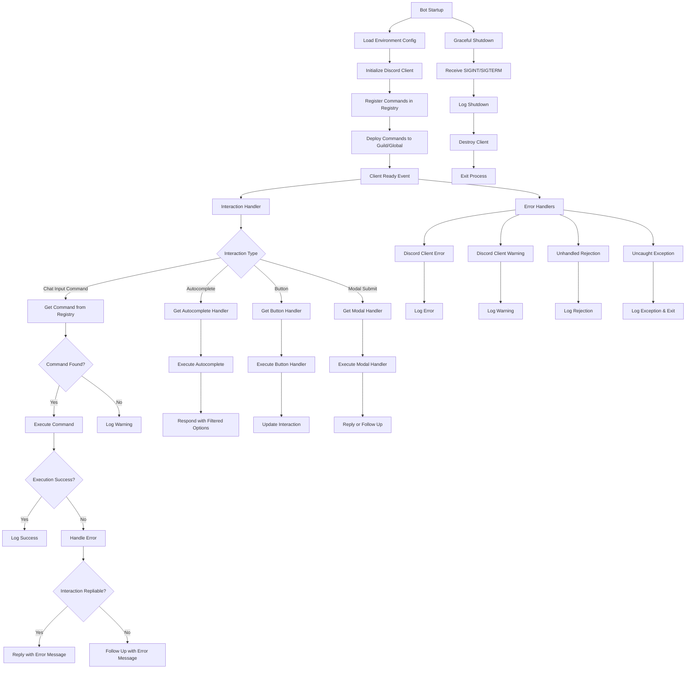

# Shapeshift Discord Bot Deficiency Report

## Executive Summary

This comprehensive analysis of the Shapeshift Discord bot codebase reveals a project in early development stages with significant architectural alignment to the AGENTS.md specifications. The codebase demonstrates solid adherence to the vertical slices and ports & adapters patterns, with proper separation of concerns between Discord interactions, business logic, and data persistence. However, several critical deficiencies exist in logging, error handling, security, and completeness that must be addressed before production deployment.

## Application Flow Diagram



## Identified Deficiencies

### 1. Code Quality Issues

#### Inadequate Logging Implementation
- **Severity:** High
- **Impact:** Debugging, monitoring, and operational visibility severely compromised
- **Files Affected:** `src/index.ts`, `src/adapters/discord/client.ts`, `src/adapters/discord/registry.ts`, `src/features/identity/discord/*.ts`, `src/features/identity/app/*.ts`, `src/features/identity/infra/*.ts`
- **Description:** The codebase extensively uses `console.log`, `console.error`, and `console.warn` instead of the specified Pino logger. This violates the AGENTS.md logging standard requiring Pino with stable fields (`component`, `guildId`, `channelId`, `userId`, `interactionId`, `route`, `status`).
- **Code Snippets:**
  ```typescript
  // src/index.ts:45-47
  console.log(`📝 Executing command: /${interaction.commandName} by ${interaction.user.tag} (${interaction.user.id})`);
  console.log(`sub-command: ${interaction.options.getSubcommand()}`)
  console.log(`options: ${JSON.stringify(interaction.options.data)}`)
  ```
- **Proposed Fix:** Implement Pino logger wrapper and replace all console statements with structured logging calls including required fields.

#### Insufficient Error Handling
- **Severity:** High
- **Impact:** Application crashes, data corruption, poor user experience
- **Files Affected:** `src/index.ts`, `src/features/identity/discord/*.ts`, `src/features/identity/app/*.ts`
- **Description:** Many functions lack try-catch blocks, and error handling is inconsistent. Database operations and Discord API calls can fail silently or cause unhandled exceptions.
- **Code Snippets:**
  ```typescript
  // src/features/identity/discord/form.autocomplete.ts:23-27
  } catch (error) {
      console.error('Error in form autocomplete:', error);
      return interaction.respond([]);
  }
  ```
- **Proposed Fix:** Implement comprehensive error handling with proper error types, logging, and graceful degradation.

#### Code Duplication
- **Severity:** Medium
- **Impact:** Maintenance burden, potential inconsistencies
- **Files Affected:** `src/features/identity/discord/*.ts`
- **Description:** Repeated patterns for validation, error responses, and interaction handling across Discord command files.
- **Code Snippets:** Similar validation and error handling code appears in `form.add.ts`, `form.edit.ts`, `form.delete.ts`.
- **Proposed Fix:** Extract common utilities and create shared error handling middleware.

### 2. Security Vulnerabilities

#### Missing Input Validation
- **Severity:** Critical
- **Impact:** SQL injection, XSS, data corruption
- **Files Affected:** `src/features/identity/discord/*.ts`, `src/features/identity/app/*.ts`
- **Description:** User inputs are not sufficiently validated. While some basic checks exist, complex inputs (URLs, names) lack proper sanitization.
- **Code Snippets:**
  ```typescript
  // src/features/identity/discord/form.add.ts:24-30
  // Validate name
  if (!name.trim()) {
      return interaction.editReply({
          content: 'Form name cannot be empty.',
          allowedMentions: DEFAULT_ALLOWED_MENTIONS
      });
  }
  ```
- **Proposed Fix:** Implement comprehensive input validation using Zod schemas or similar validation libraries.

#### Potential SQL Injection via UUID Handling
- **Severity:** High
- **Impact:** Database compromise
- **Files Affected:** `src/shared/db/uuidDetection.ts`, `src/features/identity/infra/*.ts`
- **Description:** UUID generation and handling could be vulnerable if not properly escaped in raw SQL queries.
- **Code Snippets:**
  ```typescript
  // src/shared/db/uuidDetection.ts:36-37
  const result = await db.execute(sql`SELECT uuidv7()`);
  ```
- **Proposed Fix:** Use parameterized queries and ensure all database inputs are properly sanitized.

### 3. Performance Issues

#### Inefficient Database Queries
- **Severity:** Medium
- **Impact:** Slow response times, high database load
- **Files Affected:** `src/features/identity/app/ListForms.ts`, `src/features/identity/infra/*.ts`
- **Description:** N+1 query problem in `ListForms.ts` where aliases are fetched individually for each form.
- **Code Snippets:**
  ```typescript
  // src/features/identity/app/ListForms.ts:30-35
  for (const form of forms) {
      const aliases = await aliasRepo.getByForm(form.id);
      // ...
  }
  ```
- **Proposed Fix:** Use database joins or batch queries to fetch forms with aliases in a single operation.

#### Missing Database Connection Pooling
- **Severity:** Medium
- **Impact:** Resource exhaustion under load
- **Files Affected:** `src/shared/db/client.ts`
- **Description:** Database client is created without explicit connection pooling configuration.
- **Proposed Fix:** Configure connection pooling parameters in the database client setup.

### 4. Functionality Gaps

#### Missing Proxy Feature Implementation
- **Severity:** High
- **Impact:** Core functionality incomplete
- **Files Affected:** N/A (entire `src/features/proxy/` directory missing)
- **Description:** According to AGENTS.md, the proxy feature should handle message proxying, `/send` command, context menus, and reply-style rendering. This entire feature is not implemented.
- **Proposed Fix:** Implement the complete proxy feature as specified in AGENTS.md sections 4 and 5.

#### Incomplete Command Set
- **Severity:** High
- **Impact:** Users cannot perform key operations
- **Files Affected:** N/A
- **Description:** `/alias` commands and context menus are not implemented. Only `/form` and `/ping` exist.
- **Proposed Fix:** Implement missing commands and context menus as per AGENTS.md section 5.

#### Missing ChannelProxyPort Interface
- **Severity:** Medium
- **Impact:** Architecture incomplete
- **Files Affected:** `src/shared/ports/ChannelProxyPort.ts` (file missing)
- **Description:** The core port interface for webhook operations is not implemented.
- **Proposed Fix:** Create the ChannelProxyPort interface and DiscordChannelProxy adapter.

### 5. Architecture Deviations

#### Inconsistent Layer Separation
- **Severity:** Medium
- **Impact:** Maintainability and testability reduced
- **Files Affected:** `src/features/identity/discord/*.ts`
- **Description:** Some business logic has leaked into Discord handlers instead of staying in the `app` layer.
- **Code Snippets:** Form validation logic in `form.add.ts` should be in `CreateForm.ts`.
- **Proposed Fix:** Move all business logic to `app` layer and keep Discord handlers thin.

#### Missing Repository Interfaces
- **Severity:** Low
- **Impact:** Tight coupling between layers
- **Files Affected:** `src/features/identity/infra/*.ts`
- **Description:** Repositories implement interfaces but the interfaces are not defined separately.
- **Proposed Fix:** Extract repository interfaces to improve testability and decoupling.

### 6. Discord-Specific Issues

#### Violation of 3-Second Interaction Rule
- **Severity:** Critical
- **Impact:** Interactions fail, poor UX
- **Files Affected:** `src/features/identity/discord/form.list.ts`, `src/features/identity/discord/form.add.ts`
- **Description:** Some operations (database queries) may exceed 3 seconds without deferring.
- **Code Snippets:** `form.list.ts` defers but `form.add.ts` does not always defer appropriately.
- **Proposed Fix:** Implement consistent deferring for all potentially slow operations.

#### Component Limit Violations
- **Severity:** Medium
- **Impact:** UI failures
- **Files Affected:** `src/shared/utils/pagination.ts`
- **Description:** Pagination implementation may create more than 5 action rows in edge cases.
- **Proposed Fix:** Ensure pagination respects Discord's 5-row limit.

#### Inconsistent Allowed Mentions
- **Severity:** Medium
- **Impact:** Accidental pings
- **Files Affected:** Various Discord handlers
- **Description:** Not all messages set allowed mentions explicitly.
- **Proposed Fix:** Audit and ensure all interactions set allowed mentions appropriately.

### 7. Testing and Quality Assurance

#### Insufficient Test Coverage
- **Severity:** High
- **Impact:** Bugs in production, unreliable deployments
- **Files Affected:** `tests/` directory
- **Description:** Test files exist but coverage appears minimal. No integration tests for Discord interactions.
- **Proposed Fix:** Implement comprehensive unit and integration tests.

#### Missing Quality Gate Verification
- **Severity:** High
- **Impact:** Unreliable deployments
- **Files Affected:** N/A
- **Description:** No automated checks for build, lint, typecheck, or runtime sanity.
- **Proposed Fix:** Implement CI/CD pipeline with quality gates.

## Deviations from AGENTS.md Intentions

### Current Implementation Status vs. PR Sequencing

1. **Bootstrap + DB wiring + `/ping`** ✅ Partially Complete
   - Database setup exists but logging standard not followed
   - `/ping` implemented but without proper logging

2. **Identity: /form add/list/edit/delete** ✅ Implemented but with issues
   - Commands exist but lack proper error handling and logging
   - Auto-default aliases implemented but with potential collision issues

3. **Aliases: /alias add/list/remove** ❌ Not Implemented
   - No `/alias` commands exist

4. **Proxy: tag listener + `/send`** ❌ Not Implemented
   - No proxy feature exists

5. **Message ops: context menus** ❌ Not Implemented
   - No context menus implemented

6. **Reply-style: header + quote** ❌ Not Implemented
   - No reply-style rendering

### Key Architectural Misalignments

- **Logging Standard Violation:** AGENTS.md mandates Pino with specific fields, but console.log is used throughout
- **Missing Features:** Proxy functionality is completely absent despite being core to the project
- **Incomplete UI Surface:** Only `/form` commands exist; `/alias`, `/send`, and context menus missing
- **Port Implementation:** ChannelProxyPort interface not implemented

## Prioritized Improvement Plan

### Phase 1: Critical Fixes (Immediate)
1. Implement Pino logging throughout the application
2. Add comprehensive error handling and input validation
3. Fix 3-second interaction rule violations
4. Address security vulnerabilities in input handling

### Phase 2: Core Functionality (Week 1-2)
1. Implement missing proxy feature
2. Add `/alias` commands
3. Create context menus
4. Implement reply-style rendering

### Phase 3: Quality and Performance (Week 3-4)
1. Optimize database queries
2. Add comprehensive test coverage
3. Implement CI/CD with quality gates
4. Performance monitoring and optimization

### Phase 4: Production Readiness (Week 5-6)
1. Security audit and hardening
2. Documentation completion
3. Load testing and scaling
4. Production deployment preparation

## Conclusion

The Shapeshift codebase shows promising architectural foundations aligned with AGENTS.md specifications, but requires significant work to reach production readiness. The most critical issues involve logging, error handling, and missing core functionality. Addressing these deficiencies systematically will transform this into a robust, maintainable Discord bot that fulfills its design intentions.